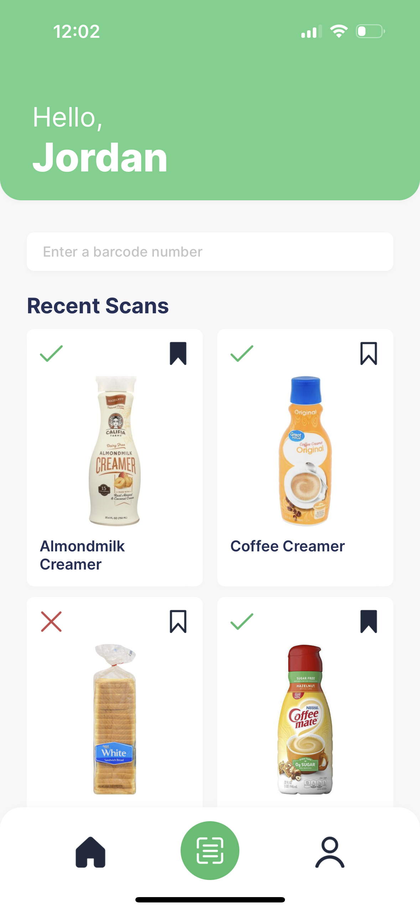
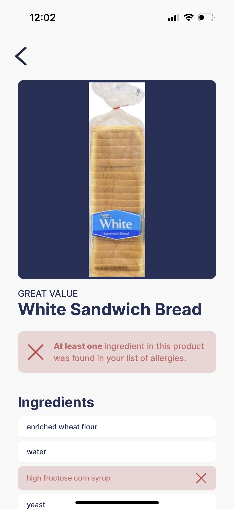
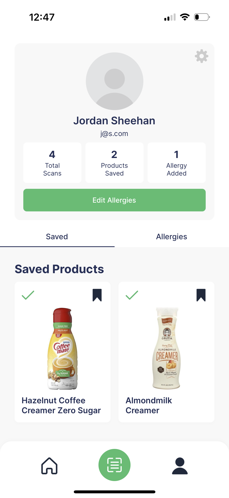
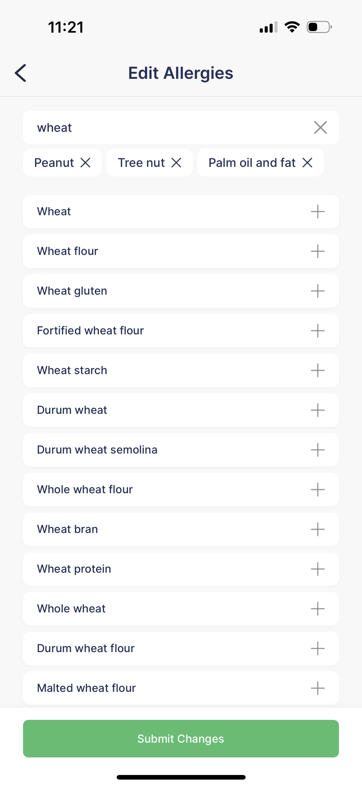

# Shopsafe

**Shopsafe** is a cross-platform mobile application that serves as a helpful tool for anyone shopping in a grocery store. Shopsafe offers the ability to create a user profile of ingredients that you'd like to avoid due to allergies, diets, or any other reason. Based on this, scan any product in a while at the grocery store and Shopsafe will report whether you should avoid it. Scanning a product will load a detailed list of ingredients, highlighting those that you want to avoid. Products can be saved at any time for future reference.

# Features

<h3 align='center'>Home Screen</h3>

On the <strong>Home Screen</strong>, users can access a number of features. All recent scans are viewable from this page.
Any product can be tapped to open a page with more detailed info about the product's ingredients. On each product,
a small icon will indicate whether the product contained ingredients they should avoid or not. The user can also press
the save icon on any product to add it to their list of saved products.

The <strong>Home Screen</strong> also provides access to Shopsafe's barcode scanner by pressing the green button in the navigation bar.
If a barcode is obstructed or it's easier to type in a barcode number, the barcode number can be manually
entered in the search bar just below the header.

---

<h3 align='center'>Barcode Scanner</h3>

The <strong>Barcode Scanner</strong> is Shopsafe's primary tool in identifying grocery store products. Point the camera at any grocery store
products and Shopsafe will automatically detect the barcode and load the product's information and identify any ingredients
you have indicated you want to avoid.

---

<h3 align='center'>Product Screen</h3>

The <strong>Product Screen</strong> will be automatically loaded when a barcode is detected by the barcode scanner. This screen can also be accessed 
by pressing a product that appears in the <strong>Recent Scans</strong> section of the <strong>Home Screen</strong> or under the <strong>Saved Products</strong>
section of the <strong>Profile Screen</strong>.

This screen displays all known ingredients of the current product. Most importantly, this screen displays a message as to whether the product contains ingredients
that were found in the user's list of allergies. Any ingredients that are contained in the user's list of allergies are highlighted in red.

---

<h3 align='center'>Profile Screen</h3>

The <strong>Profile Screen</strong> is another core screen of Shopsafe. Here, the user can access their saved products and view the list of allergies they have added
to their profile. This screen also provides access to the <strong>Edit Allergies</strong> screen, where the user can add or remove from their list of allergies at any time.

---

<h3 align='center'>Edit Allergies Screen</h3>

The <strong>Edit Allergies Screen</strong> gives the user the ability to customize the list of ingredients they wish to avoid at any time. Previously added allergies
will automatically appear at the top of the page and can be removed by pressing the "X" icon. Any other ingredients can be added as an allergy by pressing the "+" icon. 
The ingredient list is also searchable and has pagination to make finding ingredients and adding allergies easier.

